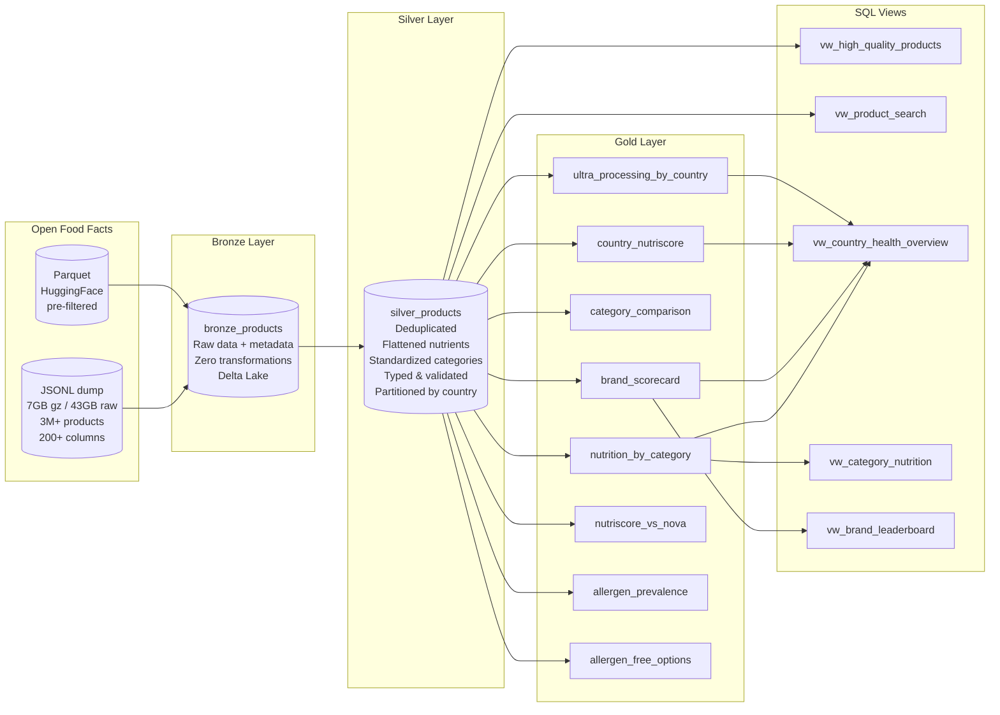

# Food Intelligence Pipeline

A complete medallion architecture (Bronze > Silver > Gold) processing the entire **Open Food Facts** database -- 3M+ food products from 150+ countries with nutrition data, health scores, allergen information, and ultra-processing classification.

Built on **Databricks Free Edition** with **PySpark** and **Delta Lake**.

## Architecture



## About the Data

**Open Food Facts** is the world's largest open-source food product database.

| Metric | Value |
|--------|-------|
| Products | 3,000,000+ |
| Countries | 150+ |
| Contributors | Crowd-sourced (100K+ users) |
| Fields | 200+ per product |
| Formats | JSONL (43GB), Parquet (~1.2GB) |
| License | Open Database License (ODbL) |
| URL | [openfoodfacts.org](https://world.openfoodfacts.org) |

Key data includes: nutrition panels (energy, fat, sugar, protein, salt per 100g), **Nutri-Score** (A-E health grade), **NOVA** group (1-4 processing classification), **Eco-Score** (A-E environmental impact), allergens, ingredients, and category taxonomy.

## Data Quality Challenges

These are real issues in the actual dataset -- not fabricated for the project.

| Challenge | What happens in the raw data | How Silver resolves it |
|-----------|------------------------------|----------------------|
| Duplicate barcodes | Multiple contributors scan the same product | Window function dedup: rank by completeness + freshness, keep best record |
| Missing nutrition (~40%) | Products with partial or no nutrition panels | `nutrition_completeness` score (0-1) lets Gold filter/weight by data quality |
| Multilingual categories | `en:cereals`, `fr:Pizzas surgelees`, `de:Getranke` | Extract English `en:` tags, fall back to any language, clean to readable names |
| Nested JSON (100+ fields) | `nutriments` struct with legacy/empty sub-fields | Flatten to typed columns, cast strings to doubles |
| Invalid nutrition values | Negative calories, energy > 4000 kcal | Null out-of-range values, set `_nutrition_was_corrected` flag |
| Inconsistent types | Nutrition stored as "250 kcal" (string with unit) | Cast to DoubleType; malformed strings become null (correct behavior) |
| Sparse columns | 200+ columns, many >90% null | Column selection: 200+ down to ~40 useful columns in Silver |
| Invalid scores | Nutri-Score values like "unknown", NOVA group = 0 | Validate against allowed-value lists from config |

## Real-World Application

This pattern mirrors production data pipelines built for the **Forward Air logistics project at Lumenalta** using Azure Databricks, Delta Lake, and Azure Data Factory. The same medallion architecture, config-driven design, and quality-check patterns apply to any domain -- logistics, e-commerce, healthcare.

## Project Structure

```
food-intelligence-pipeline/
├── README.md                           # This file
├── config/
│   └── pipeline_config.yaml            # Central config: paths, thresholds, column lists
├── notebooks/
│   ├── 00_setup.py                     # Database creation, data download, validation
│   ├── 01_bronze_ingestion.py          # Raw → Delta Lake with metadata columns
│   ├── 02_silver_cleaning.py           # Dedup, flatten, type-cast, standardize
│   ├── 03_silver_enrichment.py         # Derived columns: completeness, health tier, quality score
│   ├── 04_gold_nutrition.py            # Nutrition by category, brand scorecard, category ranking
│   ├── 05_gold_food_quality.py         # Nutri-Score/NOVA distributions by country
│   ├── 06_gold_allergens.py            # Allergen prevalence and free-from analysis
│   ├── 07_data_quality.py              # 20+ automated quality checks across all layers
│   └── 08_gold_views.py               # SQL views for dashboard consumption
├── sql/
│   ├── gold_queries.sql                # 12 ready-to-run analytical queries
│   └── exploration.sql                 # Ad-hoc data exploration queries
├── tests/
│   ├── conftest.py                     # Shared pytest fixtures
│   ├── test_bronze.py                  # 7 tests: ingestion integrity
│   ├── test_silver.py                  # 16 tests: cleaning + enrichment correctness
│   └── test_gold.py                    # 15 tests: aggregation + cross-layer consistency
└── dashboards/
    ├── screenshots/                    # Dashboard screenshots for portfolio
    └── dashboard_spec.md               # 3 dashboard specifications
```

## Setup

### Option A: Databricks Free Edition (recommended)

1. **Sign up** at [community.cloud.databricks.com](https://community.cloud.databricks.com) (free, no expiry)
2. **Clone this repo** into Databricks Repos: Workspace > Repos > Add Repo
3. **Run notebooks in order**: `00_setup` > `01_bronze` > `02_silver_cleaning` > `03_silver_enrichment` > `04-08 Gold` > `07_data_quality`
4. **Explore**: Open `sql/gold_queries.sql` in the SQL Editor and run any query

### Option B: Microsoft Fabric Trial

1. **Sign up** for [Fabric trial](https://www.microsoft.com/en-us/microsoft-fabric/getting-started) (60-day free trial)
2. **Create a lakehouse** in a Fabric workspace
3. **Upload notebooks** to the lakehouse
4. **Run in order** -- PySpark code is platform-agnostic

### Data Download

The setup notebook (`00_setup.py`) handles data download automatically. To download manually:

```bash
# Parquet (recommended for dev — ~1.2GB)
wget https://huggingface.co/datasets/openfoodfacts/product-database/resolve/main/food.parquet

# Full JSONL (production — 7GB compressed, 43GB decompressed)
wget https://static.openfoodfacts.org/data/openfoodfacts-products.jsonl.gz
```

Switch between sources by changing `active_source` in `config/pipeline_config.yaml`.

## Key Design Decisions

| Decision | Why |
|----------|-----|
| Config-driven (YAML) | Switch dev/prod sources with one line, not 8 notebook edits |
| Bronze = zero transforms | Insurance policy: replay from Bronze if Silver logic changes |
| Window function dedup | Keeps the entire best row intact; groupBy would force arbitrary aggregations per column |
| Silver partitioned by country | Most Gold queries filter by region; partition pruning skips irrelevant data |
| Separate cleaning + enrichment | Different change frequencies: dedup is stable, business rules evolve quarterly |
| Min product thresholds in Gold | Prevents misleading averages from categories with 3 products |
| Delta Lake over Parquet | ACID transactions, schema evolution, time travel for auditing |
| Materialized Gold + SQL views | Expensive frequent queries get tables; ad-hoc joins get views (zero storage) |

## Gold Tables Summary

| Table | Business Question |
|-------|-------------------|
| `gold_nutrition_by_category` | "What's the avg sugar in breakfast cereals?" |
| `gold_brand_scorecard` | "Is Brand X healthier than Brand Y?" |
| `gold_category_comparison` | "Which categories are healthiest overall?" |
| `gold_country_nutriscore` | "Does France have more A-rated products than the US?" |
| `gold_ultra_processing_by_country` | "Which country has the most ultra-processed food?" |
| `gold_nutriscore_vs_nova` | "Can ultra-processed food still score Nutri-Score A?" |
| `gold_allergen_prevalence` | "How common is gluten in cereals?" |
| `gold_allergen_free_options` | "What % of snacks are dairy-free?" |

## Sample Queries

### Top 5 Healthiest Brand

```sql
SELECT brands, product_count, avg_nutriscore_grade, avg_nova_group,
       ROUND(pct_healthy * 100, 1) AS pct_healthy
FROM gold_brand_scorecard
WHERE avg_nutriscore_numeric IS NOT NULL
ORDER BY avg_nutriscore_numeric ASC
LIMIT 5;
```

### Ultra-Processed Food by Country

```sql
SELECT primary_country, total_products, pct_nova_4_ultra_processed
FROM gold_ultra_processing_by_country
ORDER BY pct_nova_4_ultra_processed DESC
LIMIT 10;
```

### The Nutri-Score vs NOVA Paradox

```sql
-- Can a product be ultra-processed (NOVA 4) but score Nutri-Score A?
SELECT nova_group, nutriscore_grade, product_count, pct_within_nova
FROM gold_nutriscore_vs_nova
ORDER BY nova_group, nutriscore_grade;
```

## Test Suite

```bash
# Run all tests (requires Spark session — Databricks Connect or local PySpark)
pytest tests/ -v

# Run only Silver tests
pytest tests/test_silver.py -v

# Run only Gold tests
pytest tests/test_gold.py -v
```

38 tests across 3 files covering:
- Bronze: ingestion integrity, metadata columns, barcode population
- Silver: zero duplicates, valid score ranges, no negative nutrition, enrichment bounds
- Gold: threshold enforcement, percentage sums, KPI sanity, cross-layer consistency

## Certification Mapping

| Pipeline Component | DP-600 Topic | DP-700 Topic |
|-------------------|-------------|-------------|
| Bronze ingestion | Get data from sources | Ingest and transform data |
| Delta Lake tables | Create and manage lakehouses | Implement Delta Lake |
| Nutriment flattening | Transform data with Spark | Optimize Spark transforms |
| Category standardization | Clean and transform data | Design Silver layer |
| Gold aggregations | Create measures and metrics | Build consumption layer |
| SQL views | Create semantic models | Optimize query patterns |
| Data quality checks | Validate pipelines | Monitor data quality |
| Country partitioning | -- | Optimize Delta Lake (ZORDER, partitions) |

## Technologies

- **PySpark** -- distributed data processing
- **Delta Lake** -- ACID transactions, schema evolution, time travel
- **Databricks** -- notebooks, SQL editor, dashboards
- **YAML** -- configuration management
- **pytest** -- automated testing
