# Architecture

## Pipeline Flow

```mermaid
flowchart TD
    subgraph Source["Data Source"]
        OFF["Open Food Facts\n3M+ products\n200+ columns\n150+ countries"]
    end

    subgraph Phase1["Phase 1: Setup"]
        CFG["pipeline_config.yaml\nPaths, thresholds, columns"]
        SETUP["00_setup.py\nCreate DB, download data"]
    end

    subgraph Phase2["Phase 2: Bronze"]
        BRONZE["01_bronze_ingestion.py\n+ _ingestion_timestamp\n+ _source_file\n+ _batch_id\n+ _source_format\nZero transformations"]
        BT[("bronze_products\nDelta Lake\n3M+ rows x 200+ cols")]
    end

    subgraph Phase3["Phase 3: Silver"]
        CLEAN["02_silver_cleaning.py\nDedup, flatten, type,\nstandardize, validate"]
        ENRICH["03_silver_enrichment.py\nDerived columns:\ncompleteness, health tier,\nquality score"]
        ST[("silver_products\nDelta Lake\n~2.85M rows x ~45 cols\nPartitioned by country")]
    end

    subgraph Phase4["Phase 4: Gold"]
        G_NUT["04_gold_nutrition.py"]
        G_QUAL["05_gold_food_quality.py"]
        G_ALL["06_gold_allergens.py"]
        G_VIEW["08_gold_views.py"]

        GT1["nutrition_by_category"]
        GT2["brand_scorecard"]
        GT3["category_comparison"]
        GT4["country_nutriscore"]
        GT5["ultra_processing_by_country"]
        GT6["nutriscore_vs_nova"]
        GT7["allergen_prevalence"]
        GT8["allergen_free_options"]
    end

    subgraph Phase5["Phase 5: Quality"]
        DQ["07_data_quality.py\n20+ checks"]
        TESTS["pytest suite\n38 tests"]
    end

    OFF --> CFG --> SETUP --> BRONZE --> BT
    BT --> CLEAN --> ENRICH --> ST
    ST --> G_NUT --> GT1 & GT2 & GT3
    ST --> G_QUAL --> GT4 & GT5 & GT6
    ST --> G_ALL --> GT7 & GT8
    ST --> G_VIEW
    BT & ST & GT1 --> DQ
    BT & ST & GT1 --> TESTS
```



## Layer-by-Layer Decisions

### Bronze

| Decision | Choice | Why |
|----------|--------|-----|
| Write mode | `overwrite` | Source provides full dumps, not change feeds |
| Schema handling | `overwriteSchema=true` | Source adds fields without warning |
| Partitioning | None | Don't know access patterns yet |
| Format | Delta Lake | ACID transactions, time travel, schema evolution |
| Metadata | 4 underscore-prefixed columns | Lineage tracking without polluting source columns |

### Silver

| Decision | Choice | Why |
|----------|--------|-----|
| Dedup strategy | Window function (row_number) | Keeps entire best row; groupBy forces arbitrary per-column aggregations |
| Dedup ranking | completeness DESC, last_modified DESC | Best data quality wins, freshness breaks ties |
| Column pruning | 200+ down to ~40 | Config-driven; rest preserved in Bronze |
| Null handling | Null out-of-range, flag with `_was_corrected` | Never silently delete; row may have valid data in other fields |
| Type casting | DoubleType for nutrition, IntegerType for NOVA | Malformed strings become null (correct behavior) |
| Partitioning | By `primary_country` | Most Gold queries filter by country; enables partition pruning |
| Enrichment split | Separate notebook from cleaning | Different change frequencies; re-run enrichment without expensive dedup |

### Gold

| Decision | Choice | Why |
|----------|--------|-----|
| Min thresholds | 50/category, 20/brand, 100/country | Prevents misleading stats from tiny samples |
| Nutri-Score averaging | Letter to numeric to letter | Mode hides bimodal distributions; numeric average is honest |
| Tables vs views | 8 tables + 5 views | Materialize expensive+frequent; views for ad-hoc and joins |
| Allergen handling | `explode()` one-to-many | One product has N allergens; explode then aggregate at allergen level |
| Partitioning | None | Gold tables are small (aggregated); full scans are fast |

## Data Flow Volumes

```
Source:  3,000,000+ products  x 200+ columns
           │
           ▼
Bronze:  3,000,000+ rows      x 204 columns  (+4 metadata)
           │  dedup removes ~5%
           ▼
Silver:  ~2,850,000 rows      x ~45 columns   (partitioned by country)
           │  aggregate
           ▼
Gold:    ~500-5,000 rows per table             (8 tables + 5 views)
```

## Storage Layout (DBFS)

```
/FileStore/food-intelligence/
├── raw/
│   └── food.parquet                    # Source data (1.2GB)
├── delta/
│   ├── bronze/products/                # Delta table
│   ├── silver/products/                # Delta table (partitioned)
│   │   ├── primary_country=France/
│   │   ├── primary_country=Germany/
│   │   └── ...
│   └── gold/
│       ├── nutrition_by_category/
│       ├── brand_scorecard/
│       ├── category_comparison/
│       ├── country_nutriscore/
│       ├── ultra_processing_by_country/
│       ├── nutriscore_vs_nova/
│       ├── allergen_prevalence/
│       └── allergen_free_options/
└── metadata/
    ├── setup_metadata.json
    ├── bronze_metadata.json
    ├── silver_cleaning_metadata.json
    ├── silver_enrichment_metadata.json
    └── quality_report.json
```
